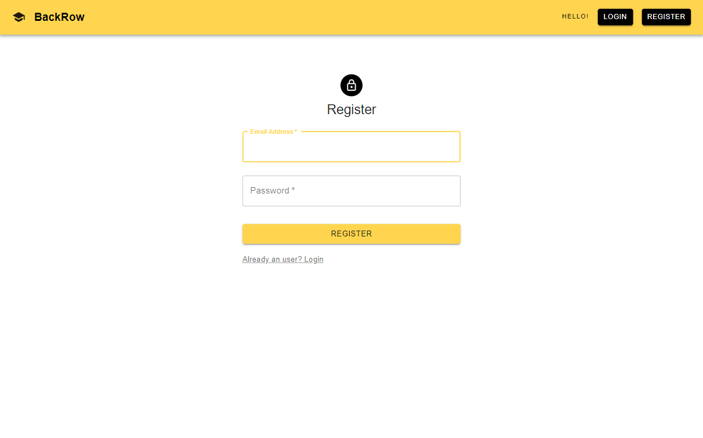
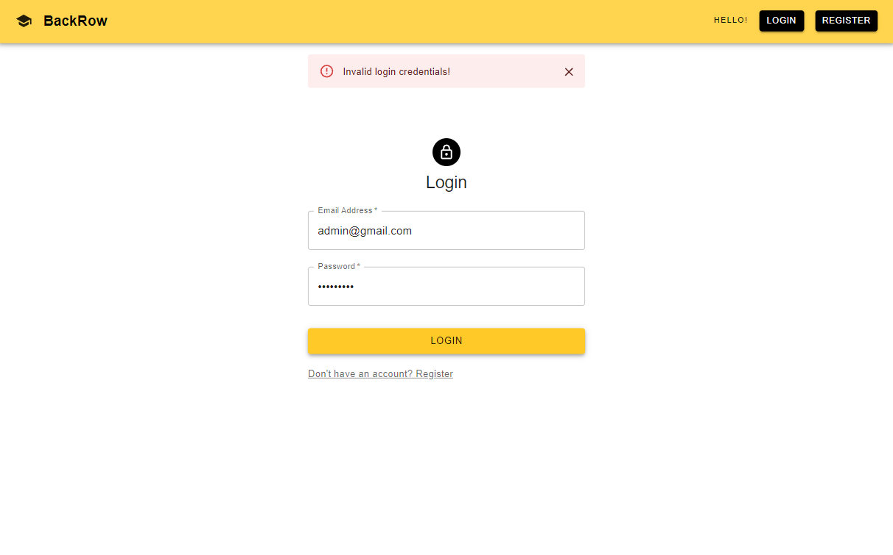
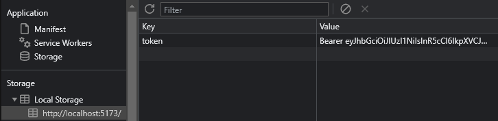
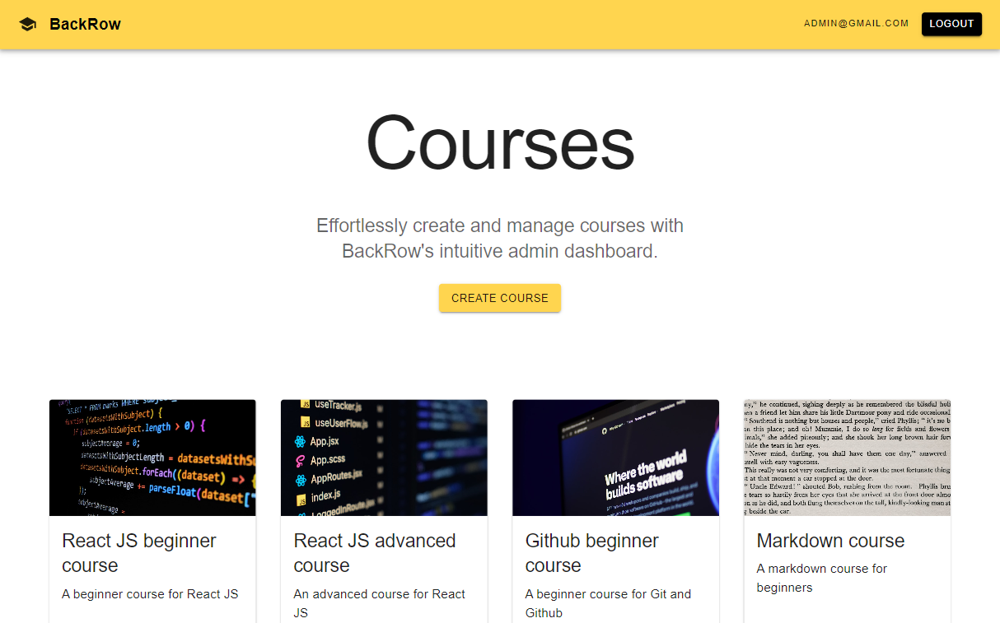
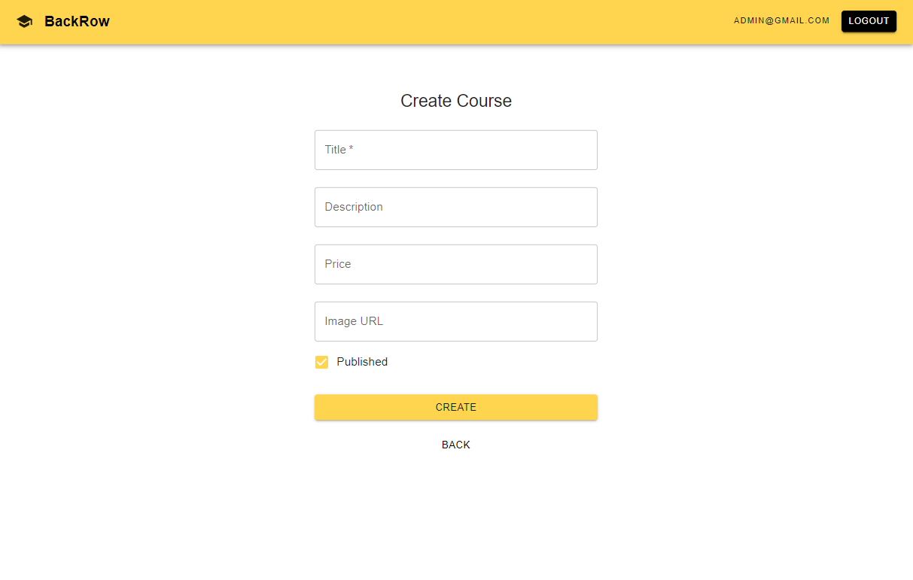
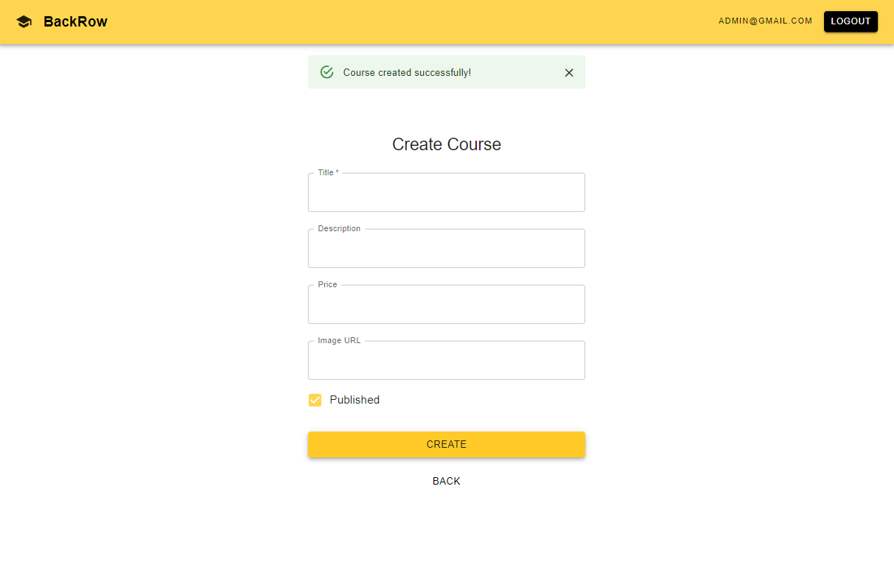

# BackRow Admin Dashboard


- BackRow is a basic `REACT` project developed to manage courses in the website as an Admin.
- For now the website has the following features for the Admin,
  - `Register`
  - `Login`
  - `Logout`
  - `Display Courses`
  - `Create Course`
- Login, Register and Logout flow use username and password authentication and other routes are protected using `JWT Token` verification.
- This project includes only the frontend of this website, the backend server program is available in this repository under [week-3/03-course-app-medium](https://github.com/Tejas-Bangera/100xdevs-All-Assignments/tree/solutions/week-3/03-course-app-medium) directory `index.js` file.
- I used [MaterialUI](https://mui.com/) library for quick and good material design and styling of this website.
- Also used the [axios](https://axios-http.com/) library to send HTTP requests to the backend server for creating the course.

## Register Page



- Register using admin `email` and `password` which is saved in the file db of the backend server.
- The server will return a `JWT Token` as response which is saved in the local storage of the client.

## Login Page


- Login using admin `email` and `password` which is matched with the admin file db of the backend server.



- If not matched Invalid Login credentials alert is displayed.

- The server will return a `JWT Token` as response which is saved in the local storage of the client.



- This `JWT Token` is used further on protected routes of the websites for verification.
- If not verified the user is rerouted to the Login page for authentication.

## Courses Page



- This page displays all the courses created in a grid.
- The grid is responsive on different devices for better user experience.

> ⚠ Note: The Edit button on the Course cards are not yet functional and are yet to be implemented.

## Create Course Page



- This page contains a form that includes the following form inputs,

  - `Title`
  - `Description`
  - `Price`
  - `Course Image`
  - `Publised`

- Used axios `POST` method to send a http request to create the course with the above inputs are the request body.
- On successful response from the backend server a success alert is displayed.



## Logout Feature

- The `Logout` button will logout the admin from the website by removing the `JWT Token` from the local storage of the client hence rerouting from protected routes to the login page.

## Project Setup and Run

#### :warning: Note: Before you run this application make sure you have the backend server up and running!

Go to `/course-selling-app-api` directory in your local machine and run the below command to install all the dependencies.

```bash
npm install
```

and run the backend server program using the below command.

```bash
node index.js
```

With the backend server up and running, time to run the frontend `React` app of the project.

Go to `/course-selling-app-client` directory in your local machine and run the below command to install all the dependencies.

```bash
npm install
```

Run the React application

```bash
npm run dev
```

Open [http://http://localhost:5173](http://http://localhost:5173) to view it in your browser.
